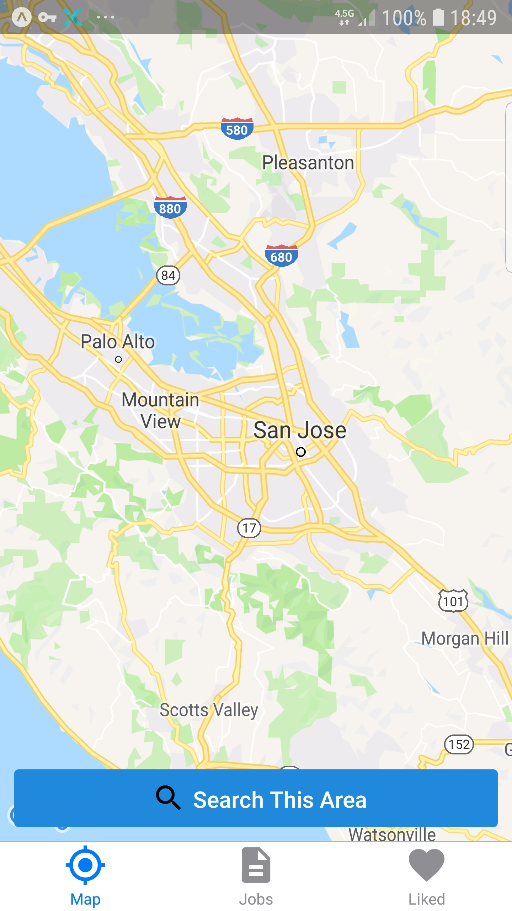
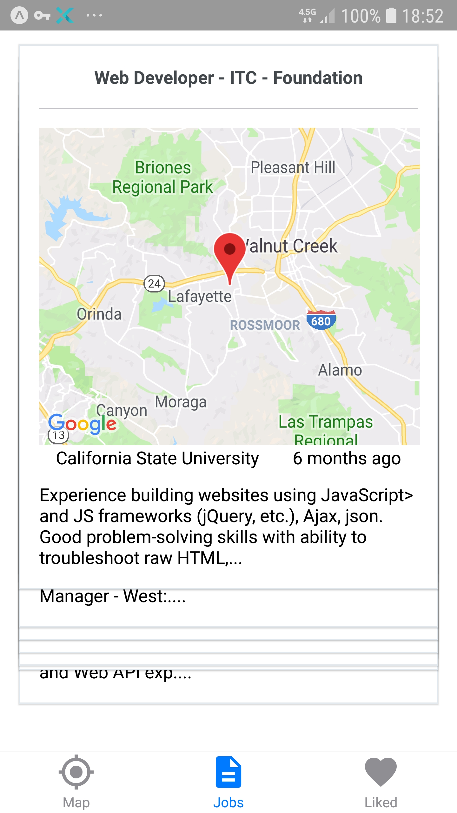
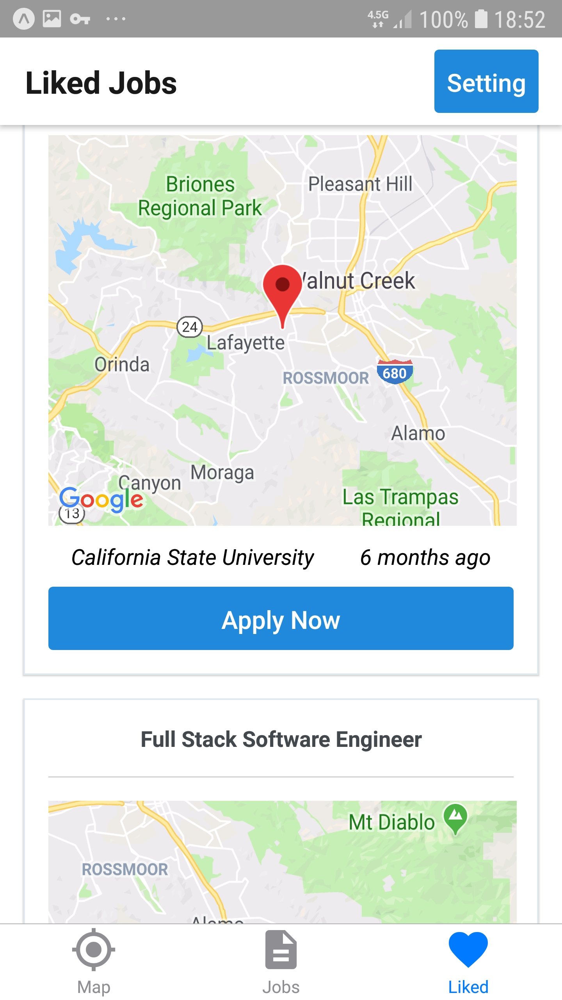

# Local Job Finder

  

A practical react-native project in order to increase my mobile development implement skills using javaScript

## About this app

### Local job finder - Apply for your favorite local jobs.

Local job finder provides a simple way of searching for your zone jobs. Search among a bunch of local jobs powered by indeed API, like your favorite and save it into your favorite lists provided by this application.
express yourself by sending them your skills, location, and professional preferences in order to apply for your dream job.

## configurations

Job finder is cross-platform and developed for each ios and Android devices. it using Facebook authentication in order to use its services for more please take a look at the requirements section.<br>
application powered by indeed API to receive your local jobs and pointing to the radius a configured.<br>
unfortunately, indeed API using the postal code to searching jobs than the application just supporting the areas that using the zip code and I not adding the feature to set your location in order to development-testing purposes;<br>
user can move around the map and selecting mentioned area for searching the application after a few async sending a receive get request (in order to find the actual postal code and give jobs list)
will navigate the user to like jobs swipe deck and I used one of my previous react native project if you wish you can access that by searching for "swipe-like-tinder" in my repositories;<br>
then your swipe right his/her favorite jobs and swipe left the jobs they just not liked;<br>
after the end of the swipe deck card, the navigation button will appear user can use it to navigate into liked jobs list it's also available on tabBar at the bottom of the screen;<br>
the liked jobs will store in AsyncStorage and available till the user delete the whole list from setting the stack tab.<br>
the application expo pushes notification setup and it provided you an easy way to push notification after getting ting a user push notification permission.<br>
also should be mentioned after one time login using Facebook authentication setup Facebook token will store in Async storage and no needed to login next time.

## Requirements

The application is on development mode so if you try to login you will receive a massage from Facebook server and it's forbids you to login.

that's cuz I'm prefer to know who exactly gonna try test my app, if you want test it out send your Facebook username/email on _chelrliswager@gmail.com_

## Built With

- axios
- expo
- latlng-to-zip
- lodash
- qs
- react
- react-native https://github.com/expo/react-native/archive/sdk-32.0.0.tar.gz"
- react-native-elements
- react-navigation
- react-redux
- redux
- redux-persist
- redux-thunk

note : A few of mentioned libraries just using for development purposes and from removed from final source codes.

## Author

- Pouria Tajdivand _initialWorks_ Stephen Grider

## Notes

## Section One (React-Navigation)

```javascript

How to set up AirB&B react ESLint

> npm install --save-dev eslint-config-airbnb eslint-plugin-jsx-a11y eslint-plugin-react eslint-plugin-import

'./.eslintrc.js'

module.exports = {
  'extends': 'airbnb',
  'parser': 'babel-eslint',
  'env': {
    'jest': true,
  },
  'rules': {
    'no-use-before-define': 'off',
    'react/jsx-filename-extension': 'off',
    'react/prop-types': 'off',
    'comma-dangle': 'off'
  },
  'globals': {
    "fetch": false
  }
}


1. implementing the first Tab Navigator
//whenever use the react navigation library find the root component and
//define the first navigator into it and render it!

import { createBottomTabNavigator, createAppContainer } from 'react-navigation';

const TabNavigator = createBottomTabNavigator({
  welcome: WelcomeScreen,
  auth: AuthScreen
});

export default createAppContainer(TabNavigator);

2. nesting Tab Navigators


const TabNavigator = createBottomTabNavigator({
  welcome: WelcomeScreen,
  auth: AuthScreen,
  main: createBottomTabNavigator({
    deck: DeckScreen,
    map: MapScreen
  })
});

3. Stack Navigator  //is using whenever needs to have some kinds of forward and back between Screens

import {createStackNavigator} from 'react-navigation';

const TabNavigator = createBottomTabNavigator({
  welcome: WelcomeScreen,
  auth: AuthScreen,
  main: createBottomTabNavigator({
    deck: DeckScreen,
    map: MapScreen,

    review: createStackNavigator({
      review: ReviewScreen,
      setting: SettingScreen
    })

  })
}, { defaultNavigationOptions: {tabBarVisible: false}
lazy: true})  ********// by default react navigation render all screen provided in TabNavigator even user not visit it by setting lazy option
                          // it will render the Screens when user try to see the screen

4. class(static) vs instace property

  //instance property is available in instace of a class
  e.g
class Screen{
  this.color = 'red'
}

const screen = Screen();
screen.color //'red'

  //class propety is available in class
  e.g
class Screen{
  static color = 'red'
}

const screen = new Screen()
screen.color //undefined
Screen.color //red

5. static navigationOptions Object

//whenever navigator (Tab and Stack) about to render screens;they look for that screen component naviagationOptions property

e.g

import {Button} from 'react-native-elements'

class ReviewScreen extends Component{

  static navigationOptions=({navigation})=>{
    return{
    headerTitle: 'Review Jobs',
    headerRight:(
      <Button title="Setting"
        onPress={()=>{navigation.navigate('setting')}}
      />

    ),
    style:{
      marginTop: Platform.OS === 'android' ? 24 : 0
    },

    title:'Map',

   	tabBarIcon: ({ tintColor }) => ({tintColor}) => <icon name='my-location or description or favorite' color={tintColor} size={30}/>
  }}
  render(){
    return;
  }
}

 //ScrollView
  <ScrollView horizental pagingEnabled />
  //Dimensions
  const SCREEN_WIDTH = Dimensions.get('window').width;
  // react native elements Button
     <Button
     title="Onwards!"
     containerStyle={{ marginTop: 10 }}
     titleStyle={{color:'red'}}
     large
     icon={{name:'search'}} or icon={{name:'delete-forever'}} or icon={{name: 'my-location'}}
     />
  //react native elements Card
   <Card title='atitle' />
  //passing multi style
  style={[styles.slideContainer, { backgroundColor: slide.color }]}

6. more on navigate
  //whenever render a component using react navigation it pass a set of props navigation to that component
  e.g

onSlideComplete = () =>{
  this.props.navigation.navigate('auth');
  }
```

## Section Two (FaceBook Authentication)

```javascript
// first step is register application in developers faceBook
//documentation is available on expo facebook

1. redux setup

> npm i redux react-redux redux-thunk


//1 creating store

import {createStore,compose,applyMiddleware} from 'redux';
import {Provider} from 'react-redux';
import thunk from 'redux-think'

const store = createStore(reducers,{},compose(applyMiddleware(thunk)))

<Provider store={store}><App/></Provider>

//2 setup reducers

import {combineReducers} from 'redux';

import auth from './auth_reducer';

export default combineReducers({
  auth
})

"./auth_reducer"
// all reducers boilerPlate

import {FACEBOOK_LOGIN_SUCCESS} from '../actions/types'

export default function(state={}, action){
  switch(action.type){
    case FACEBOOK_LOGIN_SUCCESS:
      return {token: action.payload}
    default:
      return state;
  }
}


//3 make action types and action creator

    1. AyncStorage
    // AsyncStorage is a Object that is part of react-native
    //that allows us to store small snippets of data in user phone.

    import { AsyncStorage } from 'react-native'

    // it have three utility async function:
      1. AsyncStorage.getItem('key')
      2. AsyncStorage.setItem('key', value)
      3. AsyncStorage.removeItem('key')


    export const facebookLogin = () => async dispatch =>{ //dispatch is provided by redux-thunk and using for dispatching type and payload
      let token = await AsyncStorage.getItem('fb_token')
               ***** // whenever we return a function from action creator and thunk as wire upe that function will be call with dispatch
      if(token) {
        dispatch({type: FACEBOOK_LOGIN_SUCCESS, payload: token})
      }else{
        doFaceBookLogin(dispatch)
      }
    }

    2. Expo FaceBook Process

    import { Facebook } from 'expo';

    const doFaceBookLogin = async dispatch => {
      const {type, token} = await Facebook.logInWithReadPermissionsAsync('appId', {permissions: ['public_profile']})

      if(type === 'cancel') return dispatch({type:FACEBOOK_LOGIN_FAIL })

      await AsyncStorage.setItem('fb_token',token)
      dispatch({type:FACEBOOK_LOGIN_SUCCESS, payload: token})
    }

      //import all file from index in a folder
      export * from './auth_actions'

      import * as actions from './actions'


  //4 connect component to states and actions
    import { connect } from 'react-redux'
    ***// it seems like react-redux v 7.0.0 have a bug by react native
      //i usede react-redux@6.0.1

      //clearing catch after uninstall a node package
      > expo r -c


    import * as actions from './actions'

    componentDidMount(){
      this.props.facebookLogin()  //actions are available on props
    }


    function mapStateToProps(state or {auth}){
      return {token: auth.token}
    }

    export default connect(mapStateToProps or null, actions)


  // a little bit React lifeSycle

    componentDidMount(){} //will calling when component render(born)

     //wil calling when component receive new Props and calling with new props
    componentWillReceiveProps(nextProps){
      this.onAuthComplete(nextProps) //calling a function by new props
    }

3. async lifeCycles //it's also possible to using lifeCycle methods asynchronous

  e.g.

  async ComponentWillMount(){
    const token = await AsyncStorage.getItems('fb_token')
  }

4. react navigation expo setup

const TabNavigator = createBottomTabNavigator({
  welcome: WelcomeScreen,
  auth: AuthScreen,
  main: createBottomTabNavigator({
    deck: DeckScreen,
    map: MapScreen,
    review: createStackNavigator({
      review: ReviewScreen,
      setting: SettingScreen
    })
  })
});

let Navigation = createAppContainer(TabNavigator);

  <Provider store={store}>
    <Navigation />
  </Provider>


export default App;

```

## Section Three ( MapView in reactNative)

````javascript
1. showing a map

import {MapView} from 'expo'

<View style={{flex:1}}>
  <MapView style={{flex:1}}/>
</View>

2. interact with MapView

  1.region:

    state = {
      //region is a Object => centering map and zooming
      region:{
        longitude: -122,
        latitude: 37,
        longitudeDelta: 0.04,
        latitudeDelta: 0.09
      }
    }

    <MapView region={this.state.region} />


  2. OnRegionChangeComplete:

  // this property will call whenever user move around the map and we can use it to update region
    OnRegionChangeComplete=(region)=>{
      this.setState({region})
    }

    <mapView OnRegionChangeComplete={this.OnRegionChangeComplete}/>

  3. scrollEnabled // freeze the map by default true

  <MapView scrollEnabled={false}></MapView>


  4. cacheEnabled // if true the map will render as many static image if false map will be live

  <MapView cacheEnabled={true}></MapView>

  5. initialRegion // it will set when map should centralize once map is rendered

   <MapView initialRegion={longitude: 204, latitude:456, latitudeDelta:0.045 , longitudeDelta: 0.02}></MapView>


  6. Marker

		<MapView>
		  <MapView.Marker
            coordinate={initialRegion}
            title="My Marker"
            description="Some description"
          />
		</MapView>

3.  using qs module //is short fro queryString it using for turn js object to string

> npm i qs

const JOBS_QUERY_PARMAS = {
  publisher: 'A publisherID',
  form : 'json',
  v: '2',
  latlong: 1,
  radius: 10,
  q: 'javascript'
}

const query = qs.stringify({...JOBS_QUERY_PARMAS, l: zip})
return `site.com/${query}`

4. replace js built in function // it will look for given element into string and replace it by another given screen

jobs.snippets.replace(/<b>/g,'').replace(/<\/b/g, '')

5. a big gotcha about axios:  the date that come from axios will store in a data Object...

6. Lodash uniqBy function

  return _.uniqBy([action.payload, ...state ],'jobkey') //it will return just one of object if key specified is same

7. Linking reactNative

import {Linking} from 'react-native';

Linking.openURL('https://') // open url in devices browser```
```javascript
## Section three (Offline Data Persistence)

redux-persist

> npm i redux-persist

wireup redux-persist

'./store.js'

 import { createStore, applyMiddleware } from 'redux';
import thunk from 'redux-thunk';
import { persistStore, persistReducer } from 'redux-persist';
import { AsyncStorage } from 'react-native';

import rootReducer from '../reducers';

const persistConfig = {
  key: 'root',
  storage: AsyncStorage
};

const persistedReducer = persistReducer(persistConfig, rootReducer);

export const store = createStore(persistedReducer, {}, applyMiddleware(thunk));

export const persistor = persistStore(store);


// .purge() add the end of persiststore to remove previous states for develpment puropose

export default store;


"./App.js"

import { PersistGate } from 'redux-persist/integration/react';
import { store, persistor } from './store';

  <PersistGate persistor={persistor} loading={null}>
    <Provider store={store}>
      <Navigation />
    </Provider>
  </PersistGate>

*** use redux-persist-migrate whenever changing state while deploying updates```

## Section Four (Push Notification)
```javascript
//handling push notification is three steps process in our application

//1. get permission to push notification on the device -> send token to backend server
//2. backend server get token from user and send it to expo backend->
//expo responsible by google cloud massaging or apple push notification service and send notification
//3. inside our application receive and handle notification


1. handling notification workFlow e.g. :

"./servises/pushNotifications"

import { Permissions, Notifications} from 'expo'
import {AsyncStorage} from 'react-native'

export default async() =>{
  const previousToken = await AsyncStorage.getItem('pushtoken')

  if(previousToken) return

  const {status} = await Permissions.askAsync(Permissions.REMOTE_NOTIFICATIONS)

  if (status !== 'granted') return

  const token = await Notifications.getExpoPushTokenAsync()

  await axios.post('backend server url', {token:{token}})
  AsyncStorage.setItem('pushtoken', token)
}

'./App.js'

import {Notification} from 'expo'
import registerForNotifications from './services/pushNotifications';
import {Alert} from 'react-native'

componentDidMount(){
  registerForNotifications();

  const {data:{text}, origin} = notification // === notification.data.text

  Notifications.addListener((notification)=>{ //this call back will executed any time user receive push notifications
    if(origin === 'received' && text)
    {Alert.alert(
      'New Push Notification', //title
      text, //body
      [{tex:'Ok'}] // show a button to dismiss the popup
    ) }
  })
}```
````
